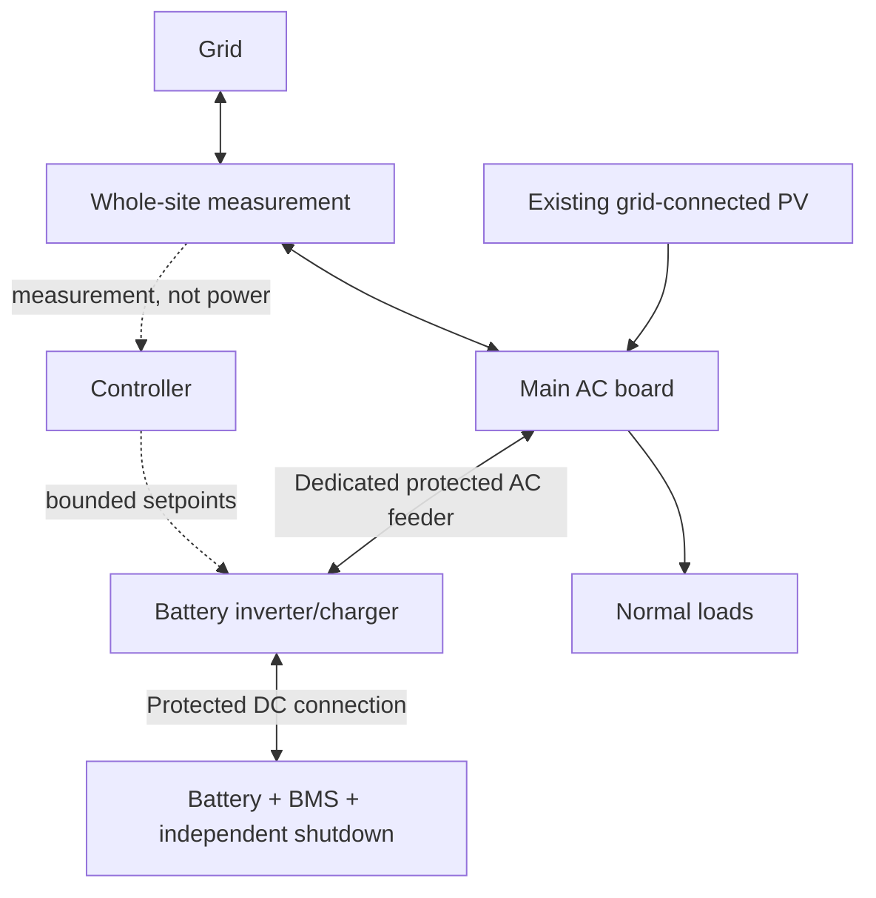
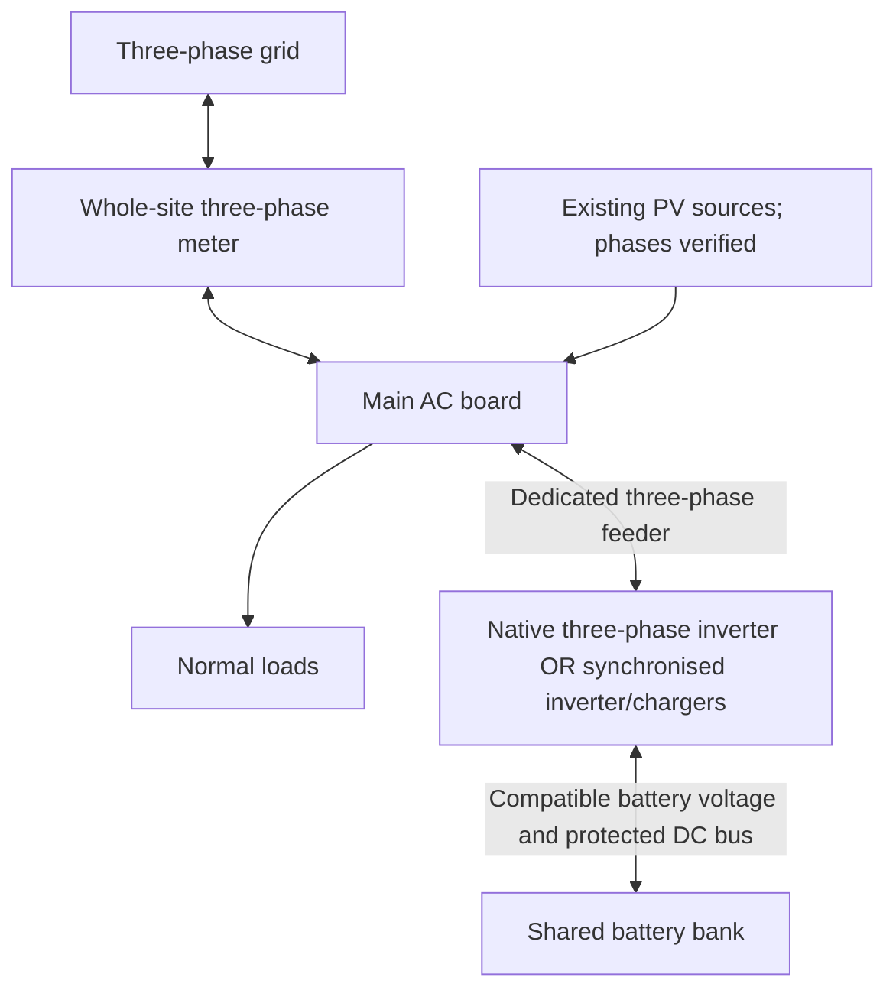

# Topology and drawing contract

All diagrams here are functional concepts. They omit terminal connections,
protective-earth/neutral arrangements, protection ratings and switching design.
They are not instructions to wire or energise an installation.

## T1: one-phase AC retrofit



The battery does not attach to the PV input of an ordinary PV inverter. Exact
hybrid capability requires the full inverter model and manufacturer documentation.
Existing PV can be retained on the grid-connected side without claiming that it
will function during a blackout. See source S2.

## T2: one-phase storage on a three-phase site

Use a whole-site three-phase meter. The battery's physical connection remains
one phase. An aggregate meter value can approach zero while another phase still
imports heavily. This is an energy-billing concept, not full per-phase support.

Example: loads `[5,0,0] kW`, battery injection on phase 2 `[0,5,0] kW` gives grid
power `[5,-5,0] kW`. The sum is zero; phase 1 still imports 5 kW. Phase labels and
manufacturer-specific configuration must be checked, not chosen casually. See S1.

## T3: true three-phase storage



Do not assume all native three-phase inverters support low-voltage DIY batteries,
asymmetric operation or the same backup behaviour. Record the exact capabilities.

The implemented `three_phase_balanced` replay splits total AC power equally. It
is not a promise of independent phase regulation. Three-phase hardware alone
does not establish that a particular configuration protects each main fuse.

## T4: selected-load or whole-site backup - design required, not implemented

```text
Grid -- verified isolation/transfer boundary -- backed-up AC distribution -- selected loads
                          |
                    grid-forming inverter
                          |
                     battery + BMS
```

Produce separate normal, island, maintenance/bypass and fault-mode drawings.
Demonstrate separation from the public grid, neutral/earthing behaviour, protective
device operation with inverter-limited fault current, PV curtailment/control,
black start and overload/load-shedding behaviour. The first tool does not simulate
or approve any of these. Sources S2, S3 and S6 define research starting points.

## Upstairs versus outdoor cabin

A 230 V connection upstairs is not proof of a suitable feeder, dedicated battery
circuit, safe battery location or single-phase utility supply. Trace it. Record
existing loads, protective devices, conductor sizes, route and installation method.
Account for source contributions along shared conductors; the upstream breaker
may not see all current supplied downstream by another source.

Evaluate the outdoor location separately for construction, moisture, temperatures,
flooding, service access, fire/incident strategy and cable routing. Prefer short
high-current DC paths when the calculated design supports it; do not prescribe a
universal cable size or pretend a wooden cabin is safe solely because it is outdoors.

## Next-generation electrical graph

Use stable IDs such as `GRID-01`, `MDB-01`, `PV-01`, `INV-01`, `BAT-01`, `CBL-01`.
Each port declares AC/DC/data/PE, voltage domain, phase(s), permitted direction and
operating mode. Each edge has endpoints, cable/reference data, source of the fact,
verification status and applicable protection boundaries. Unknown values remain
unknown. Never join separate meter boundaries without an explicit engineered scope.

Graph validation must reject incompatible voltage domains, PV-input/battery-port
confusion, missing protection/isolation evidence and island paths back to the grid.
Energy diagrams alone cannot validate PE/N connections or electrical code compliance.

## Drawing deliverables by maturity

| Maturity | Deliverable | Status |
|---|---|---|
| Now | SVG/Mermaid topology plus editable draw.io concept sheet and QElectroTech functional-block schematic | Generated from a shared concept model; concept only |
| Next | Typed graph, stable component IDs and preliminary equipment schedule | Planned |
| Design | Reviewed single-line, cable/terminal and protection schedules | Planned; technical review required |
| Build | Editable CAD files, released BOM, settings and installation method | Planned; approvals required |
| As-built | Verified revisions, test records and deviations | Planned |

The current run bundle contains `concept-sheet.drawio` (editable customer-facing
concept), `concept-sheet.svg` (preview) and `electrical-schematic.qet` (editable
generic functional blocks), generated from the same scenario and run revision.
The QET prototype includes component labels and generated stable component IDs
as editable text fields, plus the full source run ID and supply/storage model
facts as editable diagram annotations. These values are not immutable identifiers
or protected provenance: a manual edit can change them. XML input-slot pairing
and annotation content are regression-tested; actual target-editor rendering and
open/save/reopen remain unverified. Its schematic projects the shared power-edge subset; the local
controller and dashed data/control links shown in the concept sheet are omitted.
These checks do not constitute engineering approval.

The documented basis is QET XML 0.3's [editable definition fields](https://qelectrotech.org/wiki_new/doc/xml_struct_elements_0.3#les_champs_de_texte)
and [coordinate-matched instance fields and independent diagram inputs](https://qelectrotech.org/wiki_new/doc/xml_projects_0.3#champs_de_texte).
Using those fields for our IDs and run annotations is an implementation choice,
not an upstream guarantee of identity preservation. QET also documents [project
variables for title blocks](https://download.qelectrotech.org/qet/manuals/html/users/project/properties/general_prop.html)
and [element information for BOM export](https://download.qelectrotech.org/qet/manuals/html/users/element/properties/element_information.html);
those capabilities do not establish that this prototype supplies native metadata
or a procurement-ready BOM. See sources S11–S12 in [RESEARCH_SOURCES.md](RESEARCH_SOURCES.md).

Preserve the hashed generated run bundle; make a derivative copy for editing.
Open the native files in draw.io Desktop or QElectroTech; no hosted editor
integration is used, so customer data does not need to be sent to an embedded web
editor. Manual drawing edits do not flow back into the numerical model. The QET
blocks are deliberately generic rather than standards-compliant symbols. Neither
file defines cable paths, terminals, PE/N, protection, switching or backup modes.
Keep QElectroTech as a candidate reviewed schematic/panel tool, not a simulator
(S7). A dimensioned cabin plan requires surveyed dimensions and equipment clearance
requirements; these v0 deliverables are not a cabin layout or a standard-compliant
SLD.
